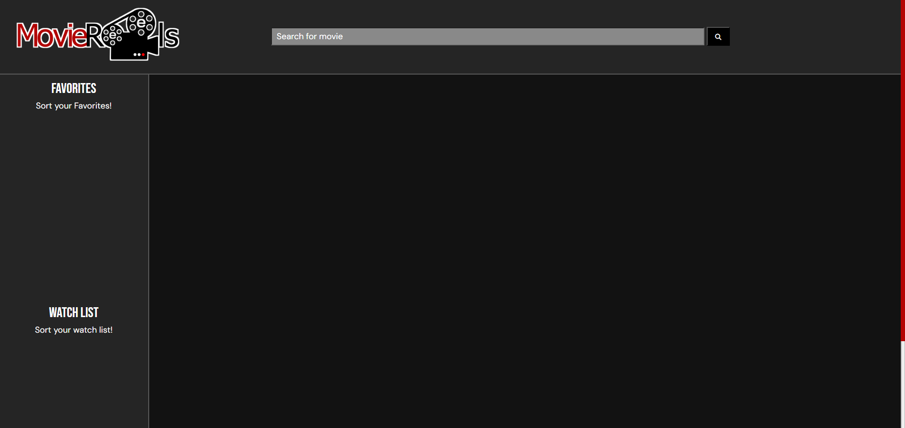

# Movie-Reels

## Description
Website: https://auom-eisiad.github.io/Movie-Reels/moviereels.html


Movie-Reels is an application that allows users to search for movie titles and find info about them. (ie. Movie Poster, Plot, Reviews from Critics, Trailer)
Then users can add that title to a watchlsit to reference later.

- Motivation: At present there are so many options to watch.  Just sitting down to view something for leisure can be a trudge.
     Having a "grocery list" can help save time previously wasted searching so people can get back to watching what they want instead of wasting
      free time. 
- Why did you build this project? All members of our group are passionate about movies and television and very much try to maximzie our time spent viewing as well as talking and sharing about them.
- What problem does it solve? It is both a time saver and a convenient place to store movie titles for oneself.
- What did you learn?

## Table of Contents (Optional)

If your README is long, add a table of contents to make it easy for users to find what they need.

- [Installation](#installation)
- [Usage](#usage)
- [Credits](#credits)
- [License](#license)

## Installation

N/A

## Usage

Provide instructions and examples for use. Include screenshots as needed.

To add a screenshot, create an `assets/images` folder in your repository and upload your screenshot to it. Then, using the relative filepath, add it to your README using the following syntax:

    ```md
    
    ```

## Credits

Collaborators:

     Daisie Moua:  https://github.com/auom-eisiad
     
     Miguel Maldonado:   https://github.com/TrueMiguel
     
     Benjamin Palacpac:   https://github.com/BenPalac1

JQuery script files used: 

    https://code.jquery.com/jquery-3.6.0.js"
    
    https://code.jquery.com/ui/1.13.2/jquery-ui.js"

Fontawesome Library/ Toolkit script link:

    https://kit.fontawesome.com/e1d81dddcf.js
    
Bulma CSS Library:

    https://cdn.jsdelivr.net/npm/bulma@0.9.4/css/bulma.min.css

Google Fonts used:

     //fonts.googleapis.com"
     
     //fonts.gstatic.com"
     
    https://fonts.googleapis.com/css2?family=DM+Sans:opsz@9..40&display=swap


## License

MIT License

Copyright (c) 2023 Daisie Moua

Permission is hereby granted, free of charge, to any person obtaining a copy
of this software and associated documentation files (the "Software"), to deal
in the Software without restriction, including without limitation the rights
to use, copy, modify, merge, publish, distribute, sublicense, and/or sell
copies of the Software, and to permit persons to whom the Software is
furnished to do so, subject to the following conditions:

The above copyright notice and this permission notice shall be included in all
copies or substantial portions of the Software.

THE SOFTWARE IS PROVIDED "AS IS", WITHOUT WARRANTY OF ANY KIND, EXPRESS OR
IMPLIED, INCLUDING BUT NOT LIMITED TO THE WARRANTIES OF MERCHANTABILITY,
FITNESS FOR A PARTICULAR PURPOSE AND NONINFRINGEMENT. IN NO EVENT SHALL THE
AUTHORS OR COPYRIGHT HOLDERS BE LIABLE FOR ANY CLAIM, DAMAGES OR OTHER
LIABILITY, WHETHER IN AN ACTION OF CONTRACT, TORT OR OTHERWISE, ARISING FROM,
OUT OF OR IN CONNECTION WITH THE SOFTWARE OR THE USE OR OTHER DEALINGS IN THE
SOFTWARE.

---

## Badges


Badges aren't necessary, per se, but they demonstrate street cred. Badges let other developers know that you know what you're doing. Check out the badges hosted by [shields.io](https://shields.io/). You may not understand what they all represent now, but you will in time.

## Features

    1.) Search bar function to search for Movies/Films
    2.) Watch later list and a Favorites list
    3.) Add to Watchlist and add to Favorites buttons
    4.) APIs that pull and display Movie data including: 
        -Movie Poster
        -Plot/Summary
        -Crtic Ratings from IMDb, Rotten Tomatoes, and MetaCritic

## How to Contribute

N/A

## Tests

N/A
